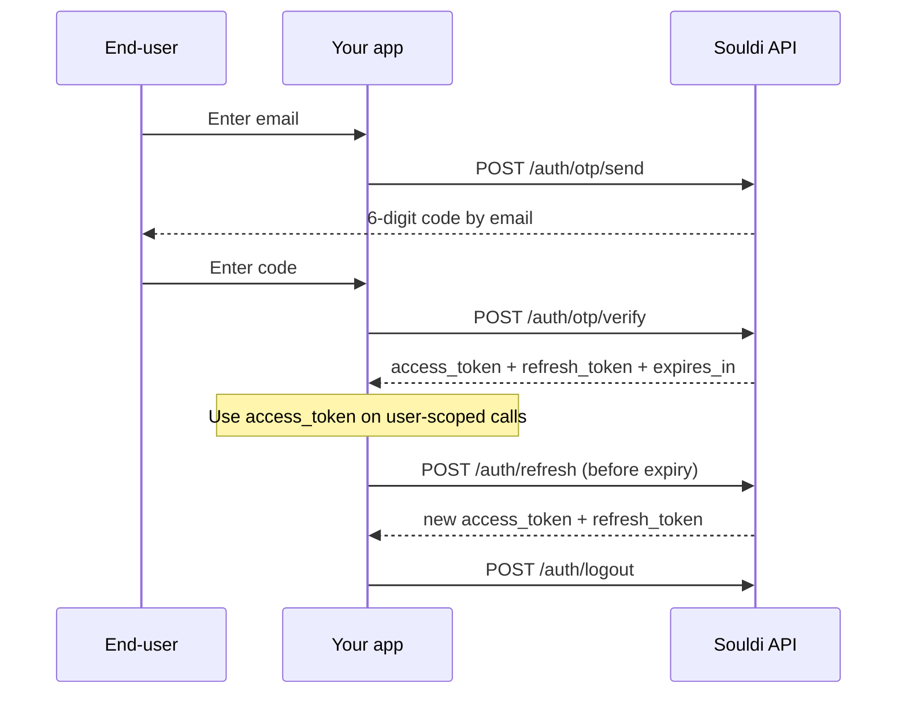

Authentication is the first thing your integration does. Souldi uses
**passwordless email OTP**: the end-user receives a 6-digit code by email,
exchanges it for a JWT session, and you refresh that session as the access token
nears expiry. This page walks through all four `/auth` endpoints in the order
you'll call them.

<Info>
  New here? The **[API Overview](/api/overview)** explains Souldi's two-layer auth
  model — the tenant key that identifies *your store* and the user session that
  identifies *the shopper*. Read it first if you haven't.
</Info>

## Conventions

Every request on this page includes these headers:

| Header | Value |
| --- | --- |
| `Content-Type` | `application/json` |
| `x-api-key` | `<your publishable key>` |

The base URL is the Souldi API endpoint, `https://api.souldi.io`. Only **`/auth/logout`** needs an additional header:
`Authorization: Bearer <access_token>`.

<Note>
  The `x-api-key` header authenticates **your store** on every request. The
  `access_token` you receive from OTP verification authenticates **the end-user**
  on user-scoped endpoints. Keep the two layers distinct.
</Note>

## The OTP flow

<Steps>
  <Step title="Send a code">
    Collect the user's email and call [`POST /auth/otp/send`](#post-auth-otp-send).
    Souldi emails them a 6-digit code.
  </Step>
  <Step title="Verify the code">
    Collect the code and call [`POST /auth/otp/verify`](#post-auth-otp-verify).
    You receive an `access_token`, a `refresh_token`, and `expires_in`. Store all
    of them.
  </Step>
  <Step title="Use the access token">
    Send `Authorization: Bearer <access_token>` on every user-scoped request
    (profile, image upload, generation).
  </Step>
  <Step title="Refresh before expiry">
    Shortly before the access token expires, call
    [`POST /auth/refresh`](#post-auth-refresh) with the `refresh_token` to get a
    fresh pair — no need to make the user log in again.
  </Step>
  <Step title="Log out when done">
    Call [`POST /auth/logout`](#post-auth-logout) to end the session, then clear
    your stored tokens.
  </Step>
</Steps>



---

## POST `/auth/otp/send`

Sends a 6-digit one-time code to the user's email address. Call this first, after
the user enters their email.

**Required headers:** `x-api-key`

### Body parameters

<ParamField body="email" type="string" required>
  The end-user's email address. The OTP code is sent here.
</ParamField>

<CodeGroup>

```bash cURL
curl -X POST "$SOULDI_API/auth/otp/send" \
  -H "Content-Type: application/json" \
  -H "x-api-key: $SOULDI_API_KEY" \
  -d '{ "email": "shopper@example.com" }'
```

```js fetch
const res = await fetch(`${SOULDI_API}/auth/otp/send`, {
  method: "POST",
  headers: {
    "Content-Type": "application/json",
    "x-api-key": SOULDI_API_KEY,
  },
  body: JSON.stringify({ email: "shopper@example.com" }),
});
```

</CodeGroup>

### Response `200`

<ResponseField name="message" type="string">
  A human-readable confirmation that the code was sent.
</ResponseField>

```json
{
  "message": "OTP sent successfully"
}
```

---

## POST `/auth/otp/verify`

Exchanges the 6-digit code for a JWT session. On success you receive an access
token and a refresh token — store both.

**Required headers:** `x-api-key`

### Body parameters

<ParamField body="email" type="string" required>
  The same email address you sent the code to.
</ParamField>

<ParamField body="token" type="string" required>
  The 6-digit code the user received by email.
</ParamField>

<CodeGroup>

```bash cURL
curl -X POST "$SOULDI_API/auth/otp/verify" \
  -H "Content-Type: application/json" \
  -H "x-api-key: $SOULDI_API_KEY" \
  -d '{ "email": "shopper@example.com", "token": "123456" }'
```

```js fetch
const res = await fetch(`${SOULDI_API}/auth/otp/verify`, {
  method: "POST",
  headers: {
    "Content-Type": "application/json",
    "x-api-key": SOULDI_API_KEY,
  },
  body: JSON.stringify({ email: "shopper@example.com", token: "123456" }),
});
const session = await res.json();
```

</CodeGroup>

### Response `200`

<ResponseField name="access_token" type="string">
  The JWT to send as `Authorization: Bearer <access_token>` on user-scoped
  requests.
</ResponseField>

<ResponseField name="refresh_token" type="string">
  The token you exchange at [`/auth/refresh`](#post-auth-refresh) for a fresh
  session.
</ResponseField>

<ResponseField name="expires_in" type="number">
  Seconds until the `access_token` expires. Use it to schedule a proactive
  refresh.
</ResponseField>

<ResponseField name="token_type" type="string">
  Always `"Bearer"`.
</ResponseField>

```json
{
  "access_token": "eyJhbGciOiJIUzI1NiIsInR5cCI6...",
  "refresh_token": "v1.M2Rh...c4f9",
  "expires_in": 3600,
  "token_type": "Bearer"
}
```

<Tip>
  Send `access_token` as `Authorization: Bearer <access_token>` on every
  user-scoped call. Store both tokens securely — see
  [Token handling](#token-handling).
</Tip>

---

## POST `/auth/refresh`

Exchanges a refresh token for a brand-new session before the current access token
expires. Use this to keep the user logged in without prompting for the email code
again.

**Required headers:** `x-api-key`

### Body parameters

<ParamField body="refresh_token" type="string" required>
  The `refresh_token` from your most recent verify or refresh response.
</ParamField>

<CodeGroup>

```bash cURL
curl -X POST "$SOULDI_API/auth/refresh" \
  -H "Content-Type: application/json" \
  -H "x-api-key: $SOULDI_API_KEY" \
  -d '{ "refresh_token": "v1.M2Rh...c4f9" }'
```

```js fetch
const res = await fetch(`${SOULDI_API}/auth/refresh`, {
  method: "POST",
  headers: {
    "Content-Type": "application/json",
    "x-api-key": SOULDI_API_KEY,
  },
  body: JSON.stringify({ refresh_token: storedRefreshToken }),
});
const session = await res.json();
```

</CodeGroup>

### Response `200`

The response shape is identical to [`/auth/otp/verify`](#post-auth-otp-verify).

<ResponseField name="access_token" type="string">
  A fresh access token.
</ResponseField>

<ResponseField name="refresh_token" type="string">
  A fresh refresh token. Both tokens rotate on every refresh.
</ResponseField>

<ResponseField name="expires_in" type="number">
  Seconds until the new `access_token` expires.
</ResponseField>

<ResponseField name="token_type" type="string">
  Always `"Bearer"`.
</ResponseField>

```json
{
  "access_token": "eyJhbGciOiJIUzI1NiIsInR5cCI6...",
  "refresh_token": "v1.N3Sb...d5a0",
  "expires_in": 3600,
  "token_type": "Bearer"
}
```

<Warning>
  Both tokens **rotate** on every refresh — the old `refresh_token` is consumed.
  Always persist the new pair from the response, or your next refresh will fail.
  The official widget refreshes about **60 seconds before expiry**.
</Warning>

---

## POST `/auth/logout`

Ends the user's session. After this call, clear your stored tokens.

**Required headers:** `x-api-key` **and** `Authorization: Bearer <access_token>`

This endpoint takes **no body**.

<CodeGroup>

```bash cURL
curl -X POST "$SOULDI_API/auth/logout" \
  -H "Content-Type: application/json" \
  -H "x-api-key: $SOULDI_API_KEY" \
  -H "Authorization: Bearer $ACCESS_TOKEN"
```

```js fetch
await fetch(`${SOULDI_API}/auth/logout`, {
  method: "POST",
  headers: {
    "Content-Type": "application/json",
    "x-api-key": SOULDI_API_KEY,
    Authorization: `Bearer ${accessToken}`,
  },
});
```

</CodeGroup>

### Response `200`

<ResponseField name="message" type="string">
  A human-readable confirmation that the session ended.
</ResponseField>

```json
{
  "message": "Logged out successfully"
}
```

---

## Token handling

<Tip>
  Persist both tokens and refresh proactively. The official widget stores them in
  `localStorage` under these keys:

  | Key | Value |
  | --- | --- |
  | `vto_access_token` | the current `access_token` |
  | `vto_refresh_token` | the current `refresh_token` |
  | `vto_expires_at` | the absolute expiry time (now + `expires_in`) in epoch ms |

  - **Refresh proactively** — call [`/auth/refresh`](#post-auth-refresh) shortly
    before `vto_expires_at` (the widget uses a ~60-second margin) rather than
    waiting for a `401`.
  - **Rotate the stored pair** — every verify and refresh returns a new
    `access_token` *and* `refresh_token`; overwrite both.
  - **On `401` or a `"Not authenticated"` response** — clear the stored session
    and re-run the OTP flow from [`/auth/otp/send`](#post-auth-otp-send).
</Tip>

<Warning>
  Treat both tokens as secrets. Never send a user's `access_token` or
  `refresh_token` to any party other than the Souldi API, and never log them.
</Warning>

## Next step

<Card title="User & Image" icon="image" href="/api/user-image">
  The user is logged in. Next, make sure they have a base photo — read their
  profile and upload one if needed.
</Card>
