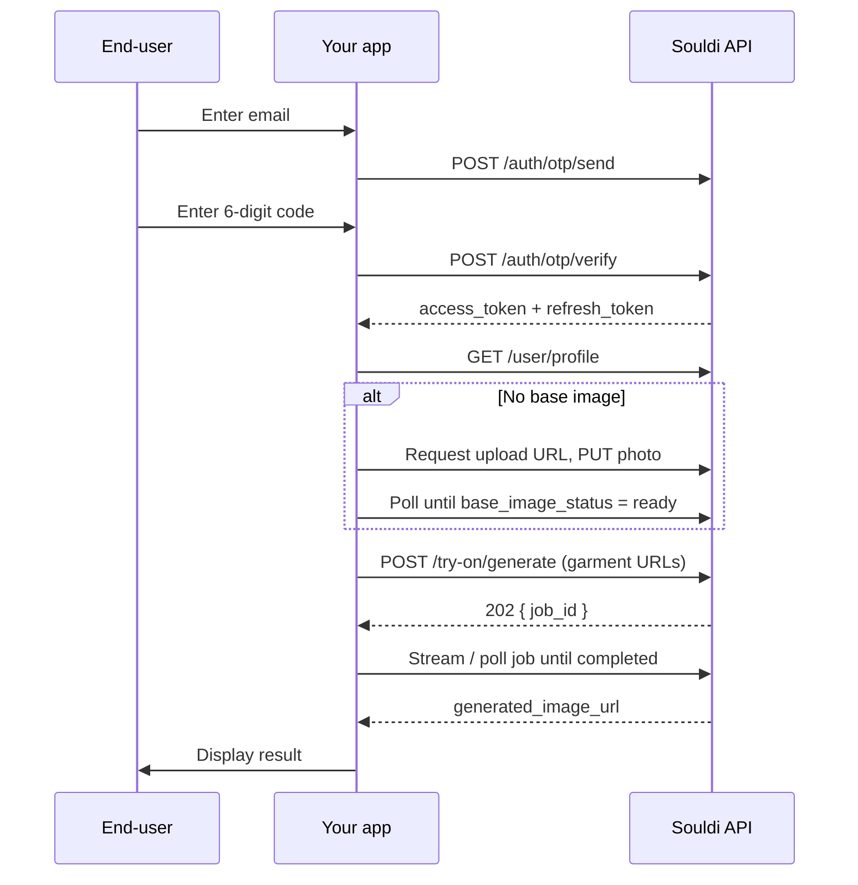

The Souldi REST API lets you build a fully custom virtual try-on experience: you
control the UI, the flow, and the look, while Souldi handles authentication,
secure photo storage, and AI generation behind the scenes. This page gives you the
big picture — how requests are authenticated and the end-to-end flow — before you
dive into the per-endpoint pages.

<Note>
  Most teams should start with the **[widget](/widget/overview)** — it's a drop-in
  script that ships the entire end-user flow out of the box. Reach for the REST API
  when you want full control over the UI and the user journey. Both paths hit the
  exact same Souldi backend, so you can mix and match.
</Note>

## Base URL & content type

All requests go to the Souldi API base URL:

```text
https://api.souldi.io
```

Requests and responses are JSON (`Content-Type: application/json`), with two
exceptions:

- The **binary photo upload** is a `PUT` directly to a signed storage URL (raw image bytes, not JSON).
- The **job stream** is a Server-Sent Events (SSE) stream of text events.

## Authentication model

Souldi uses **two layers** of authentication. The tenant key identifies *your
store*; the user session identifies *the end-user* shopping on it.

<CardGroup cols={2}>
  <Card title="Tenant key" icon="key">
    Your publishable API key, sent as the **`x-api-key`** header on **every**
    request. It identifies your store and is validated against your whitelisted
    origins.
  </Card>
  <Card title="User session" icon="user-lock">
    A JWT obtained after the end-user completes email OTP login, sent as
    **`Authorization: Bearer <access_token>`** on all user-scoped endpoints
    (profile, image upload, generation).
  </Card>
</CardGroup>

<Warning>
  Your `x-api-key` is a **publishable** key — it's safe to ship in client code, but
  it only works from origins you've whitelisted. A request from a non-whitelisted
  origin is rejected with `403`. Never send a user's `access_token` to any party
  other than the Souldi API.
</Warning>

### Required headers by endpoint group

| Endpoint group | `x-api-key` | `Authorization: Bearer` |
| --- | :---: | :---: |
| `/auth/otp/send`, `/auth/otp/verify`, `/auth/refresh` | Required | — |
| `/auth/logout` | Required | Required |
| `/user/*` | Required | Required |
| `/try-on/*` | Required | Required |
| `/search/*` | Required | — |

## End-to-end flow

Here's the full integration, start to finish. It's the same sequence the official
widget performs internally.



<Steps>
  <Step title="Authenticate the user">
    Send a one-time code to the user's email, then verify it to receive an
    `access_token` and a `refresh_token`. See
    [Authentication](/api/authentication).
  </Step>
  <Step title="Ensure a base image">
    Read the user's profile. If `has_base_image` is `false`, upload a photo and wait
    until `base_image_status` is `ready` before generating. See
    [User &amp; Image](/api/user-image).
  </Step>
  <Step title="Generate a try-on">
    `POST` the garment URL(s) to start a job. You'll get back a `job_id` with a
    `202 Accepted`. See [Generation](/api/generation).
  </Step>
  <Step title="Track the job">
    Stream the job over SSE or poll it until `status` is `completed`, then read the
    `generated_image_url`.
  </Step>
  <Step title="Display the result">
    Show the `generated_image_url` to the user — that's your finished try-on.
  </Step>
</Steps>

<Tip>
  Access tokens are short-lived. When one nears expiry, call
  [`/auth/refresh`](/api/authentication) with the `refresh_token` to get a fresh
  `access_token` without making the user log in again.
</Tip>

## Job & image statuses

Two status fields drive the flow. Poll or stream until they reach a terminal state.

<CardGroup cols={2}>
  <Card title="Try-on job status" icon="wand-magic-sparkles">
    | Status | Meaning |
    | --- | --- |
    | `pending` | Job accepted, not started yet |
    | `processing` | AI generation in progress |
    | `completed` | Result ready (`generated_image_url`) |
    | `failed` | Generation failed |
  </Card>
  <Card title="Base image status" icon="image">
    | Status | Meaning |
    | --- | --- |
    | `processing` | Photo is being preprocessed |
    | `ready` | Usable for generation |
    | `rejected` | Photo unusable — ask for a new one |
  </Card>
</CardGroup>

## HTTP status & error codes

These are the responses you'll encounter as an integrator.

| Code | Meaning | What to do |
| --- | --- | --- |
| `200` | OK | Read the response body. |
| `202` | Accepted | An async job was created — track it by `job_id`. |
| `400` | Bad request / validation | Fix the request shape or fields. |
| `401` | Unauthorized | Token invalid or expired — refresh or re-authenticate. |
| `403` | Forbidden | The request origin isn't whitelisted for this API key. |
| `404` | Not found | The resource doesn't exist. |
| `409` | Conflict | Base image is still processing — wait for `ready`. |
| `422` | Unprocessable | Base image was `rejected`, or the mode is unsupported. |
| `429` | Too many requests | Rate limited — back off and retry. |
| `502` | Upstream error | The AI provider failed — retry the request. |

<Note>
  `/try-on/generate` is rate-limited to **5 requests per 60 seconds per user**.
  Exceeding it returns `429` — back off before retrying.
</Note>

## Next steps

<CardGroup cols={3}>
  <Card title="Authentication" icon="key" href="/api/authentication">
    Email OTP login, token verification, and refresh.
  </Card>
  <Card title="User &amp; Image" icon="image" href="/api/user-image">
    Read the profile and upload a base photo.
  </Card>
  <Card title="Generation" icon="wand-magic-sparkles" href="/api/generation">
    Start a try-on job and track it to completion.
  </Card>
</CardGroup>
